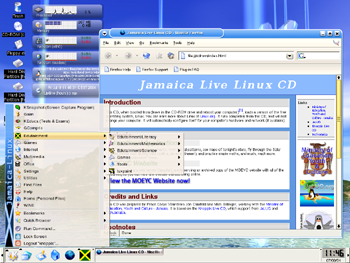

This a collection / record of some of the open source projects I worked on as a Peace Corps volunteer in Kingston, Jamaica (2002-04)

## SchoolTools

A web version of my SchoolTools CD which instead just links to the download websites (I used this CD to carry around to schools in Jamaica which had dialup, if any, Internet access)

<a href="oss/schooltools/">SchoolTools Online</a>

## The NetWorker

The NetWorker is a contact management/web/email/SMS group notification system I built while in Jamaica.  It allows SMS users to send SMS (or emails) to groups of people within the master database of users (which can be customized and sub-searched with the email address being sent to; e.g. pcj-kingston@... performed a live search for all volunteers housed or working in Kingston and sent them an SMS; pcj-it searched for it volunteers island-wide).  People could create and join groups (via the web interface), and subscribe to selected newsfeeds (weather alerts, local news, etc.).  It was great for coordination of events, parties, and for the Peace Corps Office to send out security alerts in parallel with using their phone-tree system.

We also developed a GIS map of the (previously unmapped) Kingston bus system and allowed searches of routes, points of interest, and roads/stops via SMS

## TuxType - Jamaica

A Jamaican Language/Graphic theme for <a href="http://tuxtype.sourceforge.net/" target="_new">TuxType</a>, a project created by myself and Kyle Haefner, another volunteer.

<figure class="third">
    
    
    
    <figcaption>Images from Tux Type Jamaica</figcaption>
</figure>

<ul type="square">
<li><a href="tux4kids/jamaican.zip">ZIP</a></li>
<li><a href="tux4kids/jamaican.tar.gz">Tar/GZ</a></li>
<li><a href="tux4kids/TuxType2-Jamaica_Setup.exe">Windows Installer</a></li>
</ul>

## TuxPaint - Jamaican Stamps

A handful of common Jamaican items (ackee, Dr. Bird, the flag, etc.) for use with the <a href="http://www.newbreedsoftware.com/tuxpaint/" target="_new">TuxPaint</a> software.

<ul type="square">
<li><a href="oss/tux4kids/JaStampsSetup.exe">Windows Installer</a></li>
<li><a href="oss/tux4kids/jamaicanstamps.zip">Zip file</a></li>
</ul>

## iCD : A Jamaica - customized Knoppix

As a Peace Corps volunteer in Jamaica, I re-mastered <a href="http://www.knopper.net/knoppix/index-en.html" target="_new">Knoppix</a> to provide a Jamaican visual theme.  It came pre-loaded with educational software, including the Tux4Kids customizations above.  It also ran as a portable web-server (with apache) that served the complete <a href="http://www.MOEYC.gov.jm">MOEYC website</a>.

It automatically detected and connected to the Internet through compatible GPRS-enabled cell phones on the digicel network.

<figure class="half">
  
  
  <figcaption>Images from the iCD</figcaption>
</figure>

<!--
<h2>Knowledge Sharing</h2>

<a href="http://ictdev.org/pulse">ictdev.org/pulse</a> as a tool to collect news and resources from across the ICT4D , mobiles and social media for development spectrum.

I set up <a href="http://joncamfield.com/wiki4dev/index.php/Main_Page">DevWiki</a> with organized links and summaries on various development projects, but now am focusing on using <a href="http://delicious.com/joncamfield" target="_blank">social bookmarking</a> instead

<h2>Browsing</h2>

Check out my list of favorite <a href="/projects/addons">Firefox Addons</a> that really round out the browser

A Firefox/Flock <a href="http://mycroft.mozdev.org/download.html?name=servenet&amp;submitform=Search&amp;opensearch=yes" target="_new">search-bar addons for servenet.org</a>

-->
